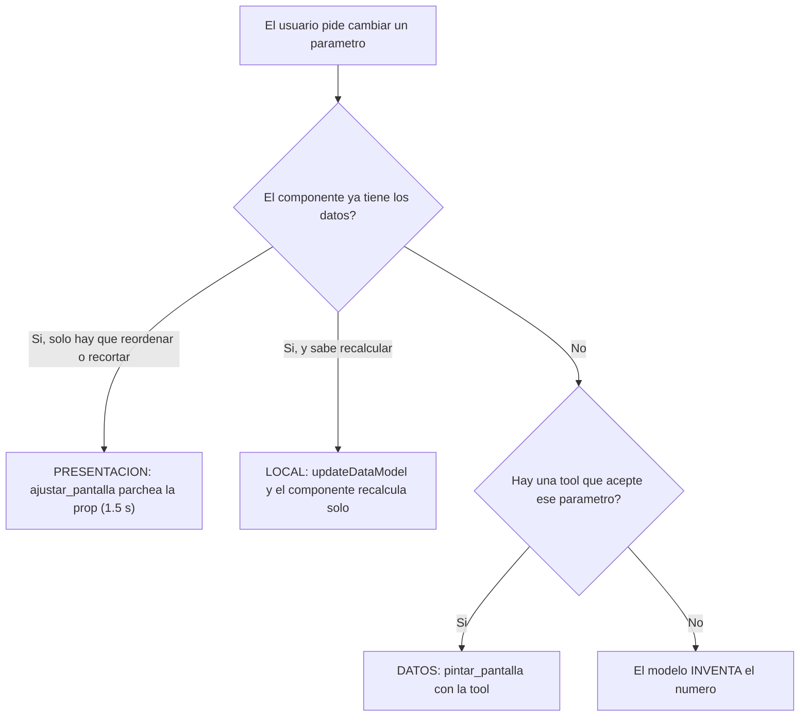

# Contexto: qué pasa hoy cuando alguien cambia un parámetro

Cruzé los **21 componentes** del catálogo contra las **23 tools** del MCP. Toda petición del tipo "cámbiame este parámetro" cae en una de cuatro cubetas, y solo la cuarta produce cifras inventadas.



**Cubeta 1 · PRESENTACIÓN** — funciona, pero solo dos componentes tienen las props: `GastoPorCategoria` (`orden`, `limite`, `categoriaAtipica`) y `Calendario` (`maximo`). Cuatro componentes más listan colecciones **sin ninguna prop de orden ni límite**, así que "muéstrame solo las 3 suscripciones más caras" cae hasta la cubeta 3 aunque el dato ya esté en pantalla.

**Cubeta 2 · LOCAL** — funciona. `SimuladorMeta` (meses y fecha), `ProyeccionCrecimiento` (interés compuesto), `RiesgoRendimiento` (ganancia anual), `PlanDePago` y `EscenariosInversion` (solo seleccionan). El riesgo aquí no es inventar: es **divergir** del backend.

**Cubeta 3 · DATOS con tool** — funciona hoy y es más ancha de lo que parece: `comparar_periodos(periodo, periodoAnterior)` acepta **dos meses arbitrarios**, `consultar_historico_inversion(semanas 2–52)` cubre "y a un año", `consultar_movimientos(desde, hasta, categoriaId, limite)`, `consultar_catalogo_inversiones(tipo, riesgoMaximo, monto)`, `detectar_fugas(mesesSinUso)`, `diagnostico_salud_financiera(periodo, mesesHistoria)`, `simular_reestructura(plazosMeses)`.

**Cubeta 4 · el agujero.** Nueve huecos, y el peor no es el que viste en pantalla.

## Los nueve huecos

| #      | Lo que pide el usuario                         | Componente afectado                                   | Hoy                                                                                                                               | Arreglo                    |
| ------ | ---------------------------------------------- | ----------------------------------------------------- | --------------------------------------------------------------------------------------------------------------------------------- | -------------------------- |
| **G1** | "¿y si invierto $X a 5 años?"                  | `ProyeccionCrecimiento` — **7 props numéricas**       | **ninguna tool calcula valor futuro**                                                                                             | tool `proyectar_inversion` |
| **G2** | "¿y en el peor caso?"                          | `EscenariosInversion` — **3 escenarios completos**    | idem                                                                                                                              | la misma tool              |
| **G3** | "¿y si lo liquido en 12 meses?"                | `ProyeccionPagoCredito`, `ComparadorAntesDespues`     | ninguna (`simular_reestructura` es **solo tarjeta**)                                                                              | tool `simular_credito`     |
| **G4** | "¿y si abono $2,000 extra al mes?"             | `ProyeccionPagoCredito.ahorroConAbonoCapitalCentavos` | **el schema ya declara el hueco**: *"hoy ninguna tool lo hace, déjalo fuera en vez de estimarlo"*                                 | la misma tool              |
| **G5** | "quiero pagar $3,000 al mes, ¿cuándo termino?" | crédito y tarjeta                                     | ninguna (es la relación inversa)                                                                                                  | la misma tool              |
| **G6** | "¿cuánto junto en 18 meses?"                   | `SimuladorMeta`                                       | `proyectar_ahorro` solo va objetivo→meses                                                                                         | exponer `horizonteMeses`   |
| **G7** | "compáralo con julio"                          | `GastoPorCategoria`                                   | `comparar_periodos` **sí** acepta dos meses, pero la fachada `analizar_gasto` **tira** `periodoAnterior`                          | exponer el parámetro       |
| **G8** | "¿y si mi perfil fuera agresivo?"              | `DistribucionPortafolio`                              | `modeloRecomendadoPara(perfil)` existe y **no se expone**                                                                         | exponer `perfil`           |
| **G9** | —                                              | `SugerenciasInversion`                                | `consultar_sugerencias_inversion.horizonteMeses` se declara, se pasa a la función de dominio y **nunca se usa**: parámetro muerto | usarlo                     |

**G1 y G2 son peores que el bug que reportaste.** `ProyeccionCrecimiento` exige `valorFinalEstimadoCentavos`, `rendimientoEstimadoCentavos`, `totalAportadoCentavos`, `tasaAnualEstimadaPct` y los `hitos[]`; **ninguna tool devuelve nada de eso**. Y el componente calcula interés compuesto en el navegador (`saldo = (saldo + aportacion) * (1 + tasaAnual/12)`, `componente.tsx:303-348`) y luego lo **calibra** contra el total que recibió: `factor = rendimientoEsperado / simulado`. O sea, la gráfica se dobla para no contradecir una cifra inventada. Se ve creíble porque el error queda en un rango plausible — al contrario del `$504,78.50`, que se delató solo. Y `ProyeccionCrecimiento` está en la portada esperada de Carmen (`scripts/probar-inicio.mjs`), o sea **está en la ruta de la demo**.

Los tres huecos de la fila G3–G5 son un solo hueco de exposición: `mensualidad()` y `tablaAmortizacion()` (`apps/mcp/src/dominio/finanzas.ts:30,52`) **no saben nada de tarjetas**, pero la única tool que las usa exige un `tarjetaId` y lanza si no hay TDC.

---

# Pasos

## 1 · Tool `proyectar_inversion` (G1, G2) — skill `tool-mcp`

- Dominio en `apps/mcp/src/dominio/inversiones.ts`: `proyectarCrecimiento(capitalInicialCentavos, aportacionMensualCentavos, tasaAnual, meses)`. **La fórmula tiene que ser idéntica a la del componente** —aportación al INICIO del mes, `saldo = (saldo + aportacion) * (1 + tasaAnual/12)`— porque si no, el factor de calibración vuelve a ser distinto de 1 y tenemos dos verdades otra vez. Es el mismo trato que ya existe entre `comunes.ts:sumarMeses` y `dominio/tiempo.ts`: se replica a propósito y **una prueba a cada lado con los mismos números** amarra el contrato.
- Escenarios desde `volatilidadAnual`, que ya está en la tabla `instrumentos`: `pesimista = tasa − σ`, `esperado = tasa`, `optimista = tasa + σ`. **Es una convención, no una predicción**, y se documenta como tal en `docs/algoritmos/proyeccion-de-inversion.md`.
- Entrada: `usuarioId`, `horizonteMeses` (3–360), `aportacionMensualCentavos`, `capitalInicialCentavos?` (default: el valor del portafolio, o 0), y `instrumentoId?` **o** `tasaAnualEstimada?` — uno de los dos; sin ninguno, la tasa sale del modelo recomendado para su perfil.
- Salida: cubre **literalmente** las props requeridas de los dos componentes. Leer `escenarios-inversion/schema.ts` para el shape exacto de `DetalleEscenario` antes de escribirla.
- **Un escenario pesimista puede dar rendimiento negativo, y hoy el componente lo esconde**: `rendimiento = Math.max(0, …)` (`proyeccion-crecimiento/componente.tsx:340`) aplasta una pérdida a cero. Se corrige para poder pintar un negativo, porque una proyección que nunca puede perder es exactamente lo que no se puede mostrar en una demo financiera.

## 2 · Tool `simular_credito` (G3, G4, G5) — skill `tool-mcp`

Una sola tool para las tres preguntas, con entrada excluyente: **exactamente uno** de `plazoObjetivoMeses`, `mensualidadObjetivoCentavos` o `abonoExtraMensualCentavos`.

- Reusa `mensualidad()` y `tablaAmortizacion()`. Para las dos variantes inversas hace falta `mesesParaLiquidar(saldo, tasaAnual, pagoMensual)`, que itera la amortización hasta cero con tope y bandera `nuncaLiquida` si el pago no cubre el interés — **el mismo patrón que ya usa `escenarioPagoMinimo`** (`finanzas.ts:136`), no un invento nuevo.
- Salida: `mensualidadActualCentavos`, `mensualidadNuevaCentavos`, `plazoRestanteActualMeses`, `plazoNuevoMeses`, `interesesActualesCentavos`, `interesesNuevosCentavos`, `ahorroInteresesCentavos`, `mesesQueAdelanta`, `dentroDeCapacidad`, y `amortizacionResumen` con los hitos, para que `ProyeccionPagoCredito` se pinte directo sin que el modelo derive nada.
- Con esto `ahorroConAbonoCapitalCentavos` **ya tiene quien lo calcule**: se actualiza su `describe` (hoy dice que ninguna tool lo hace) y se puede devolver la acción `simular_abono_capital` que se había quitado por eso mismo.
- Prueba que amarra la tool a los datos: para Ana a **15 meses** debe dar **exactamente** su `mensualidadCentavos` real (457,095), y a 12 meses **550,320** ($5,503.20). La primera aserción es la que importa: si alguien toca la fórmula, truena.

## 3 · Los parámetros que solo hay que exponer (G6, G7, G8, G9)

Sin matemática nueva; es todo cableado que ya existe y no está conectado.

- `analizar_gasto`: agregar `periodoAnterior` y `mesesSinUso` y **pasarlos** a `comparar_periodos` y `detectar_fugas` (hoy los llama sin argumento, `analizar-gasto.ts:39,41`). Esto es lo que hace que "compáralo con julio" funcione sin que el modelo tenga que bajar a la tool atómica.
- `consultar_inversiones`: `perfil?` opcional → `modeloRecomendadoPara(perfil ?? almacenado)`, y la salida marca `perfilEsHipotetico: true` cuando se sobreescribió. Sin esa bandera el modelo puede creer que el perfil de la persona cambió.
- `proyectar_ahorro`: `horizonteMeses?` opcional → devuelve `montoAlcanzableCentavos`. **Lineal y sin rendimiento**, igual que el resto de la tool, que documenta esa decisión a propósito (`proyectar-ahorro.ts:145-154`).
- `consultar_sugerencias_inversion`: usar `horizonteMeses` para filtrar por el plazo de los instrumentos, en vez de recibirlo y tirarlo. Va como issue además del arreglo.

## 4 · Todos los cambios de catálogo, y una sola regeneración — skill `cambiar-schema`

`pnpm catalogo` se corre **una vez**, al final de este paso.

- **`Conclusion.datos`**: `montoCentavos` para dinero (el componente formatea con `formatearMonto`), `valor` solo para lo que no es dinero, `.refine` que exige uno de los dos. Es la causa raíz de `$457,09.50`: hoy `valor` es `z.string()` y **el modelo escribe la cifra a mano**.
- **`SimuladorMeta`**: `.refine` de rango, y el componente **acota** la aportación a `[minima, maxima]` antes de calcular. Es el `$477.00` con piso de `$500.00`.
- **`orden` y `limite`** en `AlertaFugas`, `DetalleCategoria`, `DistribucionPortafolio` y `OrdenRebalanceo`, con el mismo patrón ya probado de `GastoPorCategoria`: helper `ordenar()`, renglón neutro de resumen para lo agrupado, y prueba de las variantes. Esto **mueve peticiones de la cubeta 3 a la cubeta 1**: pasan de repintar a un parche de 1.5 s.
- **`ProyeccionCrecimiento` y `EscenariosInversion`**: el `cuandoUsarlo` gana *"ya llamaste `proyectar_inversion`"*, calcado de `SimuladorMeta` (*"ya llamaste `proyectar_ahorro`"*), que es la única señal que el modelo lee para saber que un componente **tiene dueño**.
- `ejemplos/*.jsonl` de los componentes tocados: son few-shot, así que un ejemplo que formatea dinero a mano le enseña a formatear a mano.

## 5 · El host valida las props **resueltas**

El agujero que dejó pasar los tres bugs sin que nadie se enterara: **`revisarProps` se salta las props enlazadas** (`{ "path": … }`) porque "no se pueden validar por valor", y el modelo enlaza casi todo. En la práctica la mayoría de las props no se validan nunca.

- En `armarMensajes` y en `armarParches` el data model **está disponible**: se resuelven las props con `resolver()` de `@maya/a2ui` y se valida el resultado contra el schema Zod del componente.
- Una prop cuyo path resuelve a `undefined` se sigue saltando: puede ser un path relativo de plantilla o un dato que llega después. Es el único caso que queda fuera y va documentado.
- Ahí mismo, el rechazo de un `valor` que empiece con `$`, con el mensaje de usar `montoCentavos`.
- **Riesgo real:** esto va a cazar errores del modelo que hoy son invisibles, así que puede subir los reintentos. Se mide con `probar-guion`; si aparecen errores legítimos se corrigen ahí, no aflojando la validación.

## 6 · El prompt: cada componente con su tool

El arreglo estructural de "el modelo inventa" no es una regla más, es una tabla: **componente → tool que lo alimenta**, y la regla de que un componente sin su tool llamada en el turno no se pinta.

- Tabla corta en `apps/web/src/lib/agente/prompt.ts` para los que tienen dueño claro: `ProyeccionCrecimiento`/`EscenariosInversion` → `proyectar_inversion`; `ProyeccionPagoCredito`/`ComparadorAntesDespues` → `simular_credito` o `consultar_creditos`; `PlanDePago` → `simular_reestructura`; `SimuladorMeta` → `proyectar_ahorro`; `GastoPorCategoria` → `analizar_gasto`/`comparar_periodos`.
- Regla dura: *"una mensualidad, un plazo, un interés, una proyección o un valor futuro que no venga de una tool no se escribe: se pide"*.
- Y para el texto libre, que no se puede tipar: *"en el `titular` y el `detalle` todo monto se escribe como lo formatea la interfaz (`$5,503.20`); los centavos NUNCA se escriben como pesos"*.

## 7 · El hilo de Maya sobrevive a la pestaña y al recargar

Hoy vive en `useState` dentro de `ConsolaMaya`, que es la página `/maya`: navegar la desmonta.

- **Provider** `apps/web/src/components/maya/proveedor-agente.tsx` (cliente) que llama `usarAgente(usuarioId)` y lo expone por contexto, montado en `(app)/layout.tsx`, que **no se desmonta** al navegar (las pestañas usan `next/link`). `ConsolaMaya` lo consume.
- **`sessionStorage`** en `apps/web/src/lib/agente/persistencia.ts`, llave por usuario (`maya:hilo:v1:<usuarioId>`) para que un hilo ajeno no pueda reaparecer. Se guardan `hilo`, `conversacionId`, `sugerencias` y `razon`.
- **El detalle que rompe en silencio:** `EstadoSuperficie.componentes` es un `Map` (no es JSON) y `calcularSuperficieViva` compara **por referencia**. Al hidratar, el `estado` vivo se reconstruye apuntando **al mismo objeto** que la última pantalla congelada del hilo, no a una copia; si fueran dos objetos, la última pantalla se pintaría dos veces. Función pura con pruebas, junto a las de `colocarPantalla`.
- La voz **no** se mueve: tiene que cortar el micrófono al salir de `/maya`.
- **Cambio de usuario**: `redirect("/")` en la server action `cambiarUsuario`, y el provider hace `reiniciar()` + borra la llave anterior cuando el `usuarioId` que recibe cambia.

## 8 · Verificar

```bash
pnpm typecheck && pnpm test          # las 5 suites
pnpm catalogo                        # y git diff vacío
pnpm reiniciar-estado                # antes de cualquier ensayo
pnpm humo                            # las dos tools nuevas por HTTP
pnpm probar-inicio                   # Carmen ahora debe llamar proyectar_inversion
pnpm probar-guion                    # ¿subieron los reintentos por el paso 5?
```

A mano, los casos de esta sesión:

1. Ana: "¿cómo termino mi crédito en un año?" → llama `simular_credito`, la `Conclusion` dice **$5,503.20**, y ninguna cifra trae el punto fuera de lugar.
2. Carmen: "proyecta mi inversión a 5 años" → llama `proyectar_inversion`, y **el factor de calibración del componente vale 1.0** (la gráfica ya no se dobla).
3. "muéstrame solo las 3 suscripciones más caras" → cierra con `ajustar_pantalla`, no con `pintar_pantalla`: se ve en la tira de transparencia y debe tardar \~1.5 s.
4. Escribir en Maya → ir a Movimientos → volver: el hilo sigue. F5: sigue. Cambiar de usuario: chat vacío y en Inicio.

**Aviso:** la cuota de Gemini está agotada (issue #12, reabierto). Los pasos 1–7 se prueban con las suites y el modelo simulado, pero las cuatro verificaciones manuales, `probar-inicio` y `probar-guion` **necesitan cuota o `MODELO=claude`**. Sin eso, el paso 5 se queda sin su medición más importante y los pasos 1–2 sin la prueba de que el modelo efectivamente llama las tools nuevas.

## 9 · Documentar y registrar

- Nuevos: `docs/algoritmos/proyeccion-de-inversion.md` (la fórmula y la **convención** de los escenarios), `docs/como-funciona/persistencia-del-hilo.md`.

- Actualizar: `docs/como-funciona/tools-mcp.md` (23 → 25 tools, y `CLAUDE.md` que dice 18), `componentes-inversion-y-credito.md`, `ciclo-live.md` (la validación de props resueltas y las props de vista nuevas), `docs/algoritmos/graficas-del-catalogo.md`.

- **Issues** (`docs/issues/` + `gh issue create`, que en esta máquina no está: queda anotado como pendiente):

  - **alta** — `ProyeccionCrecimiento` y `EscenariosInversion` se pintaban con cifras inventadas, y el componente calibraba su propia gráfica contra ellas.
  - **alta** — `revisarProps` se salta las props enlazadas; es la causa de que los otros dos bugs pasaran invisibles.
  - **media** — el modelo formateaba dinero a mano en `Conclusion`.
  - **baja** — `consultar_sugerencias_inversion.horizonteMeses` era un parámetro muerto.
  - **baja** — `TermometroSaludFinanciera.tendencia` es requerida y el componente no la lee; `RendimientoHistorico` declara la acción `ver_detalle_instrumento` y emite `ver_detalle`.

- Bitácora de equipo y de rol, y `docs/tablero.md` (mi fila, cuando haya identidad en `.sesion`).

---

## Archivos críticos

- apps/mcp/src/dominio/finanzas.ts — `mensualidad()` y `tablaAmortizacion()` ya son genéricas; el paso 2 solo las expone.
- apps/mcp/src/dominio/inversiones.ts — donde nace la proyección con interés compuesto que hoy no existe en el servidor.
- packages/catalogo/src/proyeccion-crecimiento/componente.tsx — el interés compuesto del cliente y el factor de calibración que hay que dejar en 1.0.
- packages/catalogo/src/conclusion/schema.ts — el `valor: z.string()` que es la causa raíz de `$457,09.50`.
- apps/web/src/lib/agente/pantalla.ts — `revisarProps`, donde se deja de saltar las props enlazadas.
- apps/web/src/app/(app)/layout.tsx — el único punto que no se desmonta al cambiar de pestaña.
