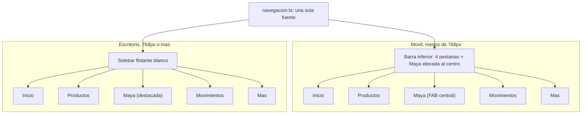

# Plan: shell web con Maya al centro

## Context

Exploré `apps/web` completo. Lo que ya existe y sirve:

- **Tokens de diseño completos** en apps/web/src/app/globals.css: `--lienzo`, `--tinte`, `--oscuro`, `--borde-sutil`, `--exito`, más los 5 de gráficas y los de sidebar, todos mapeados en `@theme inline` (por eso funcionan `bg-lienzo`, `text-exito`). No hay que tocarlos.
- **24 componentes de shadcn** en `apps/web/src/components/ui/`, con `components.json` (estilo `base-nova`, lucide). Faltan `tabs`, `dropdown-menu`, `popover`, `textarea`, `switch`, `label`.
- **Plomería del agente que funciona**: `POST /api/agente` hace stream JSONL y `components/shell/usar-agente.ts` lo consume línea por línea, aplica los mensajes A2UI y devuelve las acciones por la misma puerta.
- Next 16.3.5 con App Router, Tailwind v4 sin `tailwind.config` (todo en `globals.css`).

Lo que hay que rehacer: el shell visual es una sola pantalla (`page.tsx`) con un sidebar cuyos tres ítems **no navegan** (solo reflejan la última intención del agente).

Dos huecos que condicionan el plan:

- **7 de 8 componentes del catálogo A2UI no existen**: `packages/catalogo/src/` solo tiene `confirmacion/` con código; los otros siete son carpetas con README. Por eso el lienzo de Maya queda como placeholder.
- **Postgres es inalcanzable** (issue del 2026-09-12), así que Inicio no puede leer de la base. Se resuelve con el fallback que el ADR 0007 ya exige y nadie construyó: leer los CSV de `db/datos/` en el servidor.

## Las 5 secciones

| # | Ruta           | Sección         | Rol                                                                            | Enfoque  |
| - | -------------- | --------------- | ------------------------------------------------------------------------------ | -------- |
| 1 | `/`            | **Inicio**      | Dashboard programado: saldo, cuentas, tarjetas, resumen, movimientos recientes | **Alto** |
| 2 | `/productos`   | **Productos**   | Cuentas, tarjetas, créditos, inversiones                                       | Simple   |
| 3 | `/maya`        | **Maya**        | Chat **y** lienzo donde el agente renderiza la interfaz                        | **Alto** |
| 4 | `/movimientos` | **Movimientos** | Historial, filtros, estados de cuenta                                          | Simple   |
| 5 | `/mas`         | **Más**         | Pagos, servicios, perfil, configuración, seguridad, ayuda                      | Simple   |

**Transferir se elimina.** Con eso desaparece la sección que no tenía ni un dato detrás. Pagos y servicios quedan dentro de Más, como enlaces con estado vacío honesto.

## Navegación



### Móvil: 4 pestañas y Maya elevada

```
┌─────────────────────────────────┐
│  Inicio                    👤   │  ← barra superior 56 px
├─────────────────────────────────┤
│  ┌───────────────────────────┐  │
│  │  saldo (héroe)            │  │
│  └───────────────────────────┘  │
│  ┌──────────┐ ┌──────────┐      │
│  │ cuenta   │ │ tarjeta  │      │
│  └──────────┘ └──────────┘      │
├─────────────────────────────────┤
│  🏠    💳   ╭─────╮   📄    ⋯   │  ← 64 px + safe-area
│ Inicio Prod │  ✦  │ Movim  Más │
└─────────────╰─────╯─────────────┘
                 ↑ Maya, 56 px, degradado de marca, elevada -12 px
```

- Cuatro pestañas de **80 px** cada una y Maya al centro. Toda zona tocable ≥ 48 px (Material). `pb-[env(safe-area-inset-bottom)]` para los iPhone con notch.
- Maya no es una pestaña más: círculo de 56 px con el degradado de marca, elevado sobre la barra con `shadow-md`. Es el diferenciador del reto y tiene que verse.

### Escritorio: sidebar flotante

Reutiliza `Sidebar variant="floating"` de shadcn. Grupos: **TU BANCO** (Inicio, Productos, Movimientos), **MAYA** (destacada, con el degradado en el ítem activo), **MÁS**. Abajo, la tarjeta de contexto "Reto Banorte · Hack MTY 2026 · LLM · MCP · A2UI".

Ítem activo: píldora `bg-tinte` con texto e icono en `text-primary`, `rounded-xl`.

## Implementation steps

### 1. Actualizar la skill de diseño

`.claude/skills/diseno-banorte/SKILL.md` gana una sección nueva, \*\*Minimalism + Fintech UI

- Material Design\*\*, que es de cumplimiento obligatorio para todo el equipo (la skill está commiteada, así que les llega sola). Contenido concreto, no adjetivos:

| Principio                    | Regla verificable                                                                                                                                         |
| ---------------------------- | --------------------------------------------------------------------------------------------------------------------------------------------------------- |
| Minimalismo                  | Una sola idea por tarjeta. Un solo botón primario por pantalla. Si una tarjeta necesita dos frases de explicación, está mal partida                       |
| Jerarquía fintech            | El dato monetario es el elemento más grande de su tarjeta (`text-3xl` mínimo), con `tabular-nums` y la etiqueta arriba en `text-xs text-muted-foreground` |
| Material: state layers       | Hover `bg-current/8`, pressed `bg-current/12`. Sin ripple animado                                                                                         |
| Material: objetivos táctiles | Todo lo tocable ≥ 48 px en móvil                                                                                                                          |
| Material: rejilla de 8       | Espaciado en múltiplos de 4 px                                                                                                                            |
| Material: elevación          | Solo dos niveles: `shadow-sm` (tarjetas) y `shadow-md` (FAB, hojas, popovers). Prohibidas las 5 de Material y toda sombra de color                        |
| Material: motion             | 150–200 ms, `ease-out`. Nada de transiciones de contenedor compartido                                                                                     |
| Densidad                     | Móvil `p-4` / `gap-3`; escritorio `p-5` / `gap-4`                                                                                                         |

Se añade también a las **convenciones de `CLAUDE.md`** una línea que apunte a la skill, para que quien no la invoque igual se tope con la regla.

### 2. Componentes de shadcn que faltan

Invocar primero la skill `shadcn` (`.agents/skills/shadcn`), después:

```bash
pnpm dlx shadcn@latest add tabs dropdown-menu popover textarea switch label
```

### 3. Capa de datos que lee los CSV

Nueva, `apps/web/src/lib/datos/`. Es el fallback `FEATURE_POSTGRES=false` que el ADR 0007 exige y que no existía:

- `leer-csv.ts` — parser mínimo (mismo criterio que `scripts/validar-datos.mjs`), cacheado con `React.cache`, `server-only`.
- `consultas.ts` — funciones tipadas para lo que Inicio y Productos necesitan: `cuentasDe(usuarioId)`, `tarjetasDe`, `movimientosRecientes(usuarioId, n)`, `creditosDe`, `portafolioDe`, `resumenDe`.

Los montos siguen viajando en centavos y se formatean solo al pintar, con el `formatearMonto` que ya existe en `apps/web/src/lib/dinero.ts`.

### 4. Tres usuarios demo

`apps/web/src/lib/usuarios.ts` pasa de 2 a 3: se agrega **Carmen Elizondo Wong** (`usr_carmen`, patrimonial, con portafolio). Es lo que le da contenido a Inversiones.

Esto **contradice el ADR 0004**, que excluye "más de dos usuarios demo" e "Inversiones con rendimiento variable". Como es tu decisión explícita, el plan incluye **enmendar el ADR 0004** y cerrar `docs/issues/2026-09-12-alcance-datos-vs-adr-0004.md` con la resolución adoptada. Sin eso quedan dos documentos aceptados que se contradicen.

### 5. Shell nuevo

Se borran `sidebar-maya.tsx`, `lienzo.tsx`, `barra-conversacion.tsx` y `page.tsx`. `usar-agente.ts` **se conserva**, movido a `lib/agente/usar-agente.ts`: no es diseño, es el cliente de streaming que ya funciona.

```
apps/web/src/
  app/
    layout.tsx                  raiz: fuentes + proveedor
    (app)/layout.tsx            shell: sidebar | topbar | pestanas
    (app)/page.tsx              Inicio        [ENFOQUE]
    (app)/productos/page.tsx    Productos
    (app)/maya/page.tsx         Maya          [ENFOQUE]
    (app)/movimientos/page.tsx  Movimientos
    (app)/mas/page.tsx          Mas
  components/
    shell/
      navegacion.ts             LAS 5 SECCIONES, fuente unica
      proveedor-shell.tsx       usuario demo + estado del agente
      sidebar-app.tsx           escritorio
      barra-superior.tsx        titulo + subtitulo + selector de usuario
      barra-pestanas.tsx        movil: 4 pestanas + Maya al centro
    inicio/
      tarjeta-saldo.tsx         heroe con el degradado de marca
      lista-cuentas.tsx
      lista-tarjetas.tsx
      movimientos-recientes.tsx
    maya/
      lienzo.tsx                rejilla bento + PLACEHOLDER
      barra-conversacion.tsx    input + chips de sugerencia
  lib/
    marca.ts                    nombre, tagline, aviso legal: un solo lugar
    datos/                      leer-csv.ts, consultas.ts
    agente/usar-agente.ts       movido, sin cambios
```

`navegacion.ts` es la pieza que evita duplicar la navegación en tres componentes:

```ts
export type Seccion = {
  href: string;
  etiqueta: string;
  icono: LucideIcon;
  grupo: "banco" | "maya" | "mas";
  destacada?: boolean;   // Maya: FAB en movil, item con degradado en escritorio
};
```

### 6. Inicio (enfoque alto)

Server component con datos reales de los CSV:

1. **Héroe de saldo** — una sola tarjeta con el degradado de marca: saldo disponible de la cuenta principal, y debajo el total entre todas las cuentas. Es el único héroe de la pantalla.
2. **Cuentas** — una tarjeta por cuenta con alias, máscara y saldo. Las de crédito muestran la deuda con `text-primary`.
3. **Tarjetas** — máscara, producto, y en las de crédito una `progress` de utilización. La de Beto al 97 % se ve de inmediato: es el gancho de la demo.
4. **Movimientos recientes** — los últimos 6, con icono de categoría, comercio, fecha y monto con signo.
5. **Atajo a Maya** — tarjeta al pie con dos chips de sugerencia que llevan a `/maya` con la intención sembrada.

### 7. Maya (enfoque alto)

- **Lienzo**: la rejilla bento `grid gap-4 md:grid-cols-2 xl:grid-cols-3` con `[&>[data-ancho=amplio]]:md:col-span-2`, y **un placeholder explícito** que dibuja la rejilla y dice qué va ahí. Sin programar contenido, como pediste.
- **Barra de conversación**: `sticky bottom-4` en escritorio; en móvil fija sobre la barra de pestañas. Chips de sugerencia encima, botón Enviar en píldora roja.
- **Estado inicial**: saludo de Maya con 3 o 4 chips de arranque ("¿Cómo estoy?", "Quiero pagar menos intereses", "¿En qué se me fue el dinero?").

### 8. Las tres secciones simples

Estructura correcta, sin adornos:

- **Productos** — `tabs` con Cuentas · Tarjetas · Créditos · Inversiones. Cada pestaña, una lista de tarjetas con datos reales de los CSV.
- **Movimientos** — tabla con buscador e `toggle-group` de categorías. "Estados de cuenta" queda como estado vacío honesto.
- **Más** — lista agrupada de enlaces (Pagos, Servicios, Perfil, Configuración, Seguridad, Ayuda). Perfil y Ayuda con contenido real; el resto con estado vacío.

## Verification

```bash
pnpm -r typecheck                      # los 5 paquetes
pnpm --filter @maya/web build          # que Next compile las 5 rutas
pnpm --filter @maya/web dev            # revision manual
```

Revisión manual, contra el checklist de la skill de diseño:

- A **360 px**: las 4 pestañas más Maya caben sin apretarse; nada pegado al borde; la barra de conversación no queda tapada por la barra de pestañas.
- A **1440 px**: sidebar flotante separada del borde, ítem activo como píldora de tinte, Maya visualmente destacada.
- **Un solo héroe** en Inicio, un solo botón primario por pantalla.
- Montos con `tabular-nums` y formato `es-MX`.
- Cero hex en `.tsx`: todo por token.
- Navegar las 5 secciones en los dos tamaños sin que el layout salte.

## Critical Files

- apps/web/src/components/shell/navegacion.ts - Fuente única de las 5 secciones; sidebar y pestañas leen de aquí
- apps/web/src/app/(app)/layout.tsx - Compone el shell y decide sidebar contra pestañas
- apps/web/src/lib/datos/consultas.ts - Capa de datos sobre los CSV; el fallback que el ADR 0007 exige
- .claude/skills/diseno-banorte/SKILL.md - La regla de diseño que le llega a todo el equipo
- apps/web/src/app/globals.css - Tokens ya listos; solo se leen, no se tocan

## Lo que NO hace este plan

- **No programa el contenido del lienzo de Maya.** Queda placeholder: 7 de los 8 componentes del catálogo A2UI no existen todavía.
- **No toca** el agente, el prompt, el MCP ni el catálogo.
- **No implementa** Pagos ni Servicios: sin datos, quedan como estado vacío en Más.
- **No conecta a Postgres.** La capa de datos lee los CSV, que es el camino que funciona hoy.

## Riesgos

- **Agregar a Carmen cambia el guion de la demo.** El ADR 0004 construyó las tres fases alrededor de Beto y Ana; un tercer usuario en el selector es una pantalla más que ensayar.
- **Inicio programado compite con el pitch.** Si Inicio se ve mejor que el lienzo de Maya, el jurado ve un banco bonito y no un agente. Mitigación: el atajo a Maya al pie de Inicio, y que Maya sea el elemento más prominente de la navegación.
- **Cinco secciones a la hora 14** con 7 componentes del catálogo sin construir. Si hay que recortar, las tres secciones simples se esconden comentando una línea de `navegacion.ts`.
