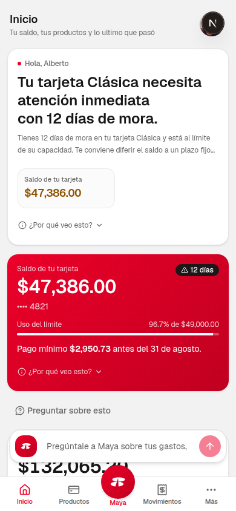
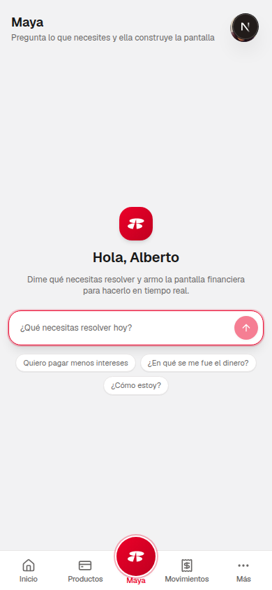
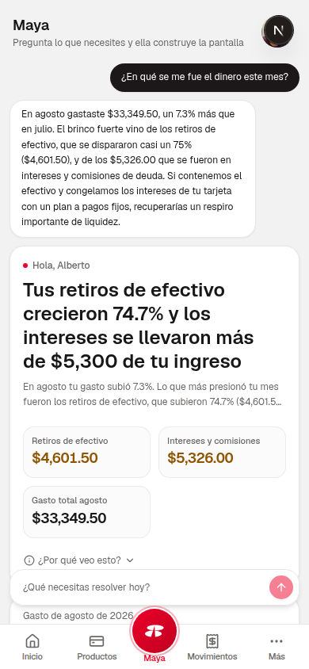
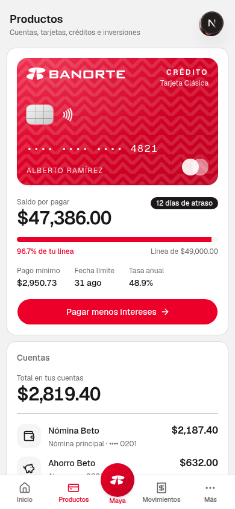
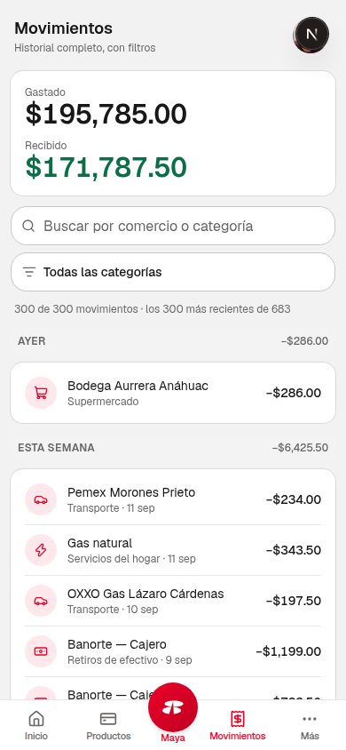
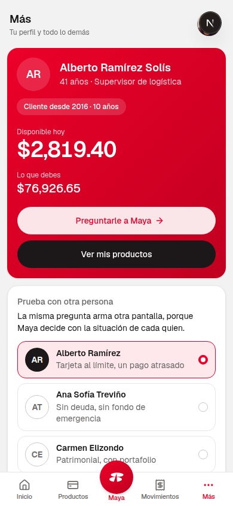
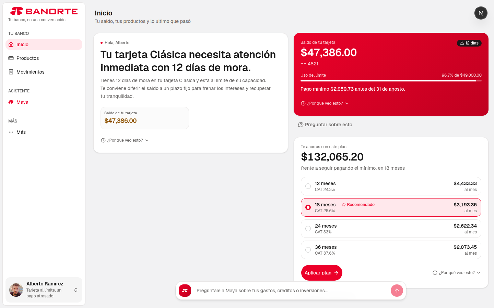
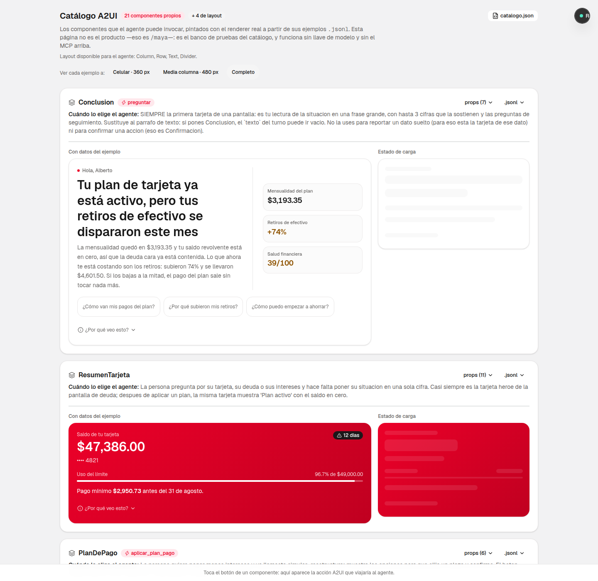
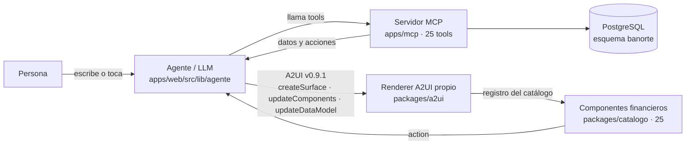

# Maya — Interfaces que la IA construye en tiempo real

**Hack Monterrey 2026 · Reto Banorte × Tec de Monterrey**

Un agente de IA que, en vez de contestar con texto, **arma la pantalla que resuelve el
problema financiero de quien pregunta**: interpreta la intención, obtiene datos y
acciones de un servidor MCP propio, describe la interfaz con el protocolo **A2UI** y la
pinta con un catálogo de componentes financieros diseñado por el equipo. Lo que la
persona toca en esa pantalla regresa al agente y **cambia la experiencia**: la misma
pregunta, hecha por dos personas con contextos distintos, produce dos interfaces
distintas.

> **Prototipo de hackathon.** Es un concepto de exploración sobre el asistente **Maya**
> de Banorte, construido para el reto; **no es oficial, no está afiliado a Banorte y no
> mueve dinero real**. Todos los datos (personas, saldos, movimientos, tarjetas) son
> sintéticos; ninguna persona real aparece en ellos.

**Demo en vivo:** [ghekkinxmaya.tech](https://ghekkinxmaya.tech) · MCP:
[mcp.ghekkinxmaya.tech/health](https://mcp.ghekkinxmaya.tech/health) · Catálogo:
[ghekkinxmaya.tech/catalogo/v1.json](https://ghekkinxmaya.tech/catalogo/v1.json) · Docs:
[docs.ghekkinxmaya.tech](https://docs.ghekkinxmaya.tech)

---

## Tabla de contenido

- [Qué es Maya](#qué-es-maya)
- [Cómo se ve](#cómo-se-ve)
- [El ciclo completo, con un ejemplo real](#el-ciclo-completo-con-un-ejemplo-real)
- [Cómo está construido](#cómo-está-construido)
- [Stack técnico](#stack-técnico)
- [Correr el proyecto](#correr-el-proyecto)
- [Variables de entorno](#variables-de-entorno)
- [Comandos](#comandos)
- [Estructura del repositorio](#estructura-del-repositorio)
- [Pruebas y calidad](#pruebas-y-calidad)
- [Documentación técnica](#documentación-técnica)
- [Rúbrica del reto y qué la cubre](#rúbrica-del-reto-y-qué-la-cubre)
- [Equipo](#equipo)
- [Aviso legal](#aviso-legal)

---

## Qué es Maya

El reto oficial pedía que un modelo de IA no solo conteste una pregunta financiera,
sino que **construya en tiempo real la interfaz** que la resuelve, con tres piezas no
negociables: un **LLM** al centro que interpreta la intención, un servidor **MCP** que
expone los datos y las acciones, y **A2UI** como el protocolo con el que el agente
describe esa interfaz a un cliente que la renderiza.

Maya es nuestra respuesta: una banca conversacional donde la pantalla no está
programada de antemano. Cuando alguien pregunta *"¿en qué se me fue el dinero?"* o
*"¿cómo pago menos intereses?"*, el agente:

1. **Interpreta la intención** con el contexto real de esa persona (su tarjeta, su
   gasto, sus metas).
2. **Llama al MCP** — el servidor que sabe de dinero — para leer datos o, si hace
   falta, ejecutar una acción de verdad (aplicar un plan de pago, guardar una meta).
3. **Describe la pantalla** con mensajes A2UI (`createSurface`, `updateComponents`,
   `updateDataModel`) usando únicamente los componentes de nuestro catálogo.
4. **Recibe de vuelta** lo que la persona toca en esa pantalla (un botón, un slider) y
   cierra el ciclo: vuelve a llamar al MCP, y la interfaz se actualiza con el resultado
   real — el saldo baja, aparece el calendario de pagos, la conclusión cambia.

No hay una pantalla de "resultado de aplicar un plan" programada aparte: es la misma
tarjeta, repintada con el nuevo estado. Ese ciclo —intención → interfaz → acción → la
UI cambia— es, según la rúbrica del reto, lo que separa una demo completa de una a
medias.

## Cómo se ve

Capturas tomadas contra el servidor local (`pnpm dev`), con el modelo real (Gemini) y
datos sintéticos de PostgreSQL. Diseño **móvil primero** (390 px), con la misma
interfaz adaptada a escritorio.

### Inicio: la portada que arma un modelo chico para cada persona

Un modelo ligero decide, con los datos reales de la cuenta, qué tarjetas mostrar y en
qué orden — sin repintar si nada cambió desde la última vez.



### Maya: la conversación que construye la pantalla

Antes de preguntar, tres sugerencias de arranque. Después de preguntar *"¿en qué se me
fue el dinero este mes?"*, el agente responde en texto **y** arma una tarjeta con las
cifras que lo sostienen — nunca una cifra que no venga del MCP.

<p>
  
  
</p>

### Productos: la tarjeta de crédito con su plan de pago

El componente `ResumenTarjeta` con el diseño real de una tarjeta Banorte (chip,
contactless, últimos 4 dígitos) y el botón de acción que dispara el ciclo completo.



### Movimientos: el historial agrupado por periodo



### Más: cambia de persona y la misma pregunta arma otra pantalla

Tres perfiles con situaciones opuestas (tarjeta al límite, sin deuda, con portafolio de
inversión): cambiar de persona aquí reconstruye Inicio desde cero con **otra**
interfaz.



### La misma app en escritorio



### El catálogo: los 25 componentes que el agente puede invocar

Galería del renderer A2UI real, fuera del producto, en `/catalogo`: cada componente
con su schema de props, cuándo lo elige el agente y sus tres estados (con datos,
cargando, vacío).



## El ciclo completo, con un ejemplo real

La conversación de arriba (*"¿En qué se me fue el dinero este mes?"*) recorrió las
cuatro piezas no negociables del reto:

```
Usuario "¿en qué se me fue el dinero?"
   │
   ▼
Agente (Gemini 3.8 Flash · apps/web/src/lib/agente)
   interpreta la intención → llama analizar_gasto
   │
   ▼
MCP (apps/mcp · 25 tools)
   lee banorte.movimientos en PostgreSQL, calcula la categoría atípica
   y regresa cifras reales: retiros de efectivo +74.7 %, intereses $5,326.00
   │
   ▼
Agente emite A2UI: createSurface + updateComponents
   restringido al catálogo (Conclusion + tarjetas de cifra)
   │
   ▼
Renderer A2UI propio (packages/a2ui)
   valida contra los JSON Schema oficiales, resuelve bindings, pinta
   │
   ▼
Componentes del catálogo (packages/catalogo)
   la persona ve la tarjeta con "¿Por qué veo esto?" y botones de seguimiento
   │
   └──▶ si toca un botón ("Aplicar plan"), la action regresa al agente
        y el ciclo empieza de nuevo con el estado ya cambiado
```

## Cómo está construido

| Pieza | Carpeta | Qué hace | No hace |
|---|---|---|---|
| **Agente** | `apps/web/src/lib/agente/` | Interpreta la intención con el AI SDK, llama tools MCP, emite A2UI restringido al catálogo, recibe las `action` de la UI y cierra el ciclo | No pinta nada directamente; no guarda datos |
| **Servidor MCP** | `apps/mcp/` | 25 tools (de lectura y de acción) sobre datos sintéticos en PostgreSQL; el estado que las acciones mutan vive en `banorte.acciones_aplicadas` | No sabe de UI ni de A2UI |
| **Renderer A2UI** | `packages/a2ui/` | Motor propio (~850 líneas) fiel a la spec v0.9.1: valida con los JSON Schema oficiales (76 casos de conformidad), procesa mensajes, resuelve bindings, pinta con el registro | No decide qué mostrar |
| **Catálogo A2UI** | `packages/catalogo/` | 21 componentes financieros propios + 4 de layout, sobre shadcn/ui y la paleta de Banorte, con schema Zod de props | No llama al MCP directamente |
| **Contratos de tools** | `packages/schemas/` | Zod de entrada/salida de las 25 tools, fuente de verdad compartida entre MCP y agente | — |
| **Datos** | PostgreSQL, esquema `banorte` | Tres perfiles demo con contexto opuesto, y el estado mutable que las acciones cambian; esquema y migraciones en `db/` | No hay CSV ni fallback: sin `DATABASE_URL` el MCP no arranca, a propósito (ADR 0010) |



Cada acción del usuario (tocar "Aplicar plan", mover un slider, cambiar de persona)
regresa al agente como una `action` de A2UI; el agente vuelve a llamar al MCP y emite
una interfaz nueva con el estado real ya cambiado — eso es lo que cierra el ciclo.

## Stack técnico

Todo en **TypeScript** (ADR 0001):

- **Next.js 16** (App Router) + **Tailwind v4** + **shadcn/ui** para el host de la UI
  generativa y la cara visible de la app.
- **Servidor MCP** propio en TypeScript con `@modelcontextprotocol/sdk`, transporte
  Streamable HTTP.
- **Vercel AI SDK** para el turno del agente; modelo principal **Gemini 3.8 Flash**
  (rápido y barato para iterar en vivo), con **Claude Sonnet 5** como respaldo (ADR
  0005).
- **A2UI v0.9.1** real, con **motor y catálogo propios** (sin `@a2ui/react`): validado
  contra los JSON Schema oficiales y sus 76 casos de conformidad (ADR 0003 + 0008).
- **Zod** para los schemas compartidos entre tools MCP, props de componentes y
  respuestas estructuradas del agente.
- **PostgreSQL 17** (con TimescaleDB disponible) como única fuente de datos; nada vive
  en CSV ni en memoria (ADR 0010).
- **Vitest** para pruebas unitarias en los 5 paquetes del monorepo.
- **pnpm** workspaces como único gestor de paquetes.
- **ElevenLabs** (opcional, detrás de un flag) para el modo de voz.
- Deploy con **Coolify** sobre un VPS propio, HTTPS y dominio automáticos.

## Correr el proyecto

Requiere **Node 22** y **pnpm 10**.

```bash
git clone https://github.com/Ghekkin/Reto-Banorte-hack-mty.git
cd Reto-Banorte-hack-mty
cp .env.example .env          # y llena DATABASE_URL (obligatoria) y la llave de Gemini
pnpm install
pnpm dev                      # levanta el MCP en :3100 y la web en :3000; espera sus /health
```

Abre **http://localhost:3000**.

- **`DATABASE_URL` es obligatoria**: los datos viven en PostgreSQL y el MCP no arranca
  sin base (ADR 0010). El password de la base compartida del equipo está en el panel de
  Coolify o en `/opt/reto/.env` del VPS. Si la base quedara vacía, `pnpm datos:restaurar`
  la repuebla desde el volcado versionado en el repo.
- **Sin llave de modelo** (`GOOGLE_GENERATIVE_AI_API_KEY`) la web abre igual, pero el
  agente responde con una pantalla de ejemplo y lo dice en el stream — útil para probar
  el catálogo y el renderer sin gastar cuota.
- El catálogo de componentes que el agente puede invocar se sirve en
  **http://localhost:3000/catalogo/v1.json** — es el `catalogId` de cada superficie
  A2UI, y también se navega visualmente en **http://localhost:3000/catalogo**.

## Variables de entorno

Todas están comentadas en [`.env.example`](.env.example); estas son las que importan
para levantar el proyecto:

| Variable | Obligatoria | Qué hace |
|---|---|---|
| `DATABASE_URL` | **Sí** | Conexión a PostgreSQL, esquema `banorte`. Sin ella el MCP no arranca (a propósito) |
| `GOOGLE_GENERATIVE_AI_API_KEY` | Recomendada | Llave de Google AI Studio para el modelo principal (Gemini). Sin ella, el agente responde con una pantalla de ejemplo |
| `MODELO` | No (`gemini` por default) | `gemini` o `claude`; cuál motor usa el turno del agente |
| `ANTHROPIC_API_KEY` | Solo si `MODELO=claude` | Llave de respaldo, con tope de gasto |
| `MCP_PUERTO` / `MCP_URL` | No (`3100` / `localhost:3100/mcp`) | Puerto fijo del servidor MCP y dónde lo busca el agente |
| `MCP_TOKEN` | Recomendada | `Authorization: Bearer` que exige el MCP; vacío = sin autenticación |
| `URL_CATALOGO` | No | URL pública del `catalogo.json` que va en cada `createSurface` |
| `FEATURE_INICIO_PERSONALIZADO` | No (`1`) | Con `0`, Inicio vuelve a ser la pantalla programada de siempre, sin modelo |
| `FEATURE_WIDGETS_VIVOS` | No (`0`) | Con `1`, cada tarjeta de Inicio se puede preguntar y cambia en su lugar (requiere migración `0005`) |
| `NEXT_PUBLIC_FEATURE_VOZ` | No (`0`) | Prende el botón de voz con ElevenLabs (premio lateral) |

## Comandos

| Comando | Qué hace |
|---|---|
| `pnpm install` | Una sola vez; Node 22 y pnpm 10 |
| `pnpm dev` | Levanta MCP (3100) y web (3000), en ese orden, y espera sus `/health` |
| `pnpm docs:dev` | Sitio de documentación interactiva (Astro + Starlight) en `:4321` |
| `pnpm typecheck` | `tsc` en los 5 paquetes del monorepo |
| `pnpm test` | `vitest` en los 5 paquetes |
| `pnpm humo` | Prueba de humo del MCP: lista las 25 tools y llama una (necesita `pnpm dev` corriendo) |
| `pnpm probar-guion` | Ensaya los pasos del guion de demo con el **modelo real** |
| `pnpm catalogo` | Regenera `packages/catalogo/catalogo.json` desde los schemas Zod |
| `pnpm reiniciar-estado` | Vacía `banorte.acciones_aplicadas` — antes de cada ensayo de demo |
| `pnpm datos:migrar` | Aplica `db/migraciones/*.sql` (idempotente) |
| `pnpm datos:fixture` / `datos:restaurar` | Regenera el volcado de pruebas desde la base / repuebla la base desde ese volcado |
| `pnpm corridas` | Lee las últimas corridas del modelo guardadas en PostgreSQL (turno completo, chat, registros) |

## Estructura del repositorio

```
apps/
  web/        Host Next.js 16: shell del producto, /api/agente (stream), API REST de
              lectura, /catalogo/v1.json, el agente (src/lib/agente), Inicio
              personalizado (src/lib/inicio) y widgets vivos (src/lib/widgets)
  mcp/        Servidor MCP Streamable HTTP: 25 tools sobre PostgreSQL (esquema banorte)
  docs/       Documentación interactiva y presentación (Astro + Starlight + React)
packages/
  a2ui/       Motor A2UI propio: validación, procesamiento, bindings, renderer React
  catalogo/   Catálogo de 25 componentes financieros (21 propios + 4 de layout)
  schemas/    Schemas Zod compartidos de las 25 tools del MCP
db/           schema.sql, reiniciar.sql y migraciones — los datos viven en PostgreSQL,
              no en el repo
scripts/      dev.sh, humo.sh, deploy.sh, migrar.mjs, restaurar.mjs, corridas.mjs...
docs/         Documentación técnica: decisiones de arquitectura (ADR), cómo funciona
              cada pieza, algoritmos no triviales
capturas/     Las imágenes de este README
```

Mapa completo, paquete por paquete, con el número de pruebas de cada uno:
[`docs/decisiones/`](docs/decisiones/) y [`docs/arquitectura/vision-general.md`](docs/arquitectura/vision-general.md).

## Pruebas y calidad

| Paquete | Qué prueba | Pruebas |
|---|---|---|
| `apps/web` | Agente, Inicio personalizado, widgets vivos, API REST | 229 |
| `apps/mcp` | 25 tools, ciclos `simular → aplicar → la lectura cambia` verificados por HTTP | 135 |
| `packages/a2ui` | Los 4 mensajes A2UI, bindings, árbol, y los **76 casos de conformidad oficiales** de la spec | 112 |
| `packages/catalogo` | Los 25 componentes, sus tres estados y sus schemas de props | 124 |
| `packages/schemas` | Los schemas Zod de las 25 tools | 15/15 |

"Hecho" en este repo significa: `pnpm typecheck` en verde, `pnpm test` en verde,
`pnpm humo` contra el MCP arriba, y los prompts del guion de demo produciendo la
interfaz esperada con el modelo real.

## Documentación técnica

La documentación de arquitectura, decisiones y algoritmos vive en [`docs/`](docs):

- [`docs/decisiones/`](docs/decisiones/) — 12 ADR: por qué TypeScript en todo, por qué
  Python solo detrás de una tool, por qué A2UI propio en vez de `@a2ui/react`, por qué
  PostgreSQL es la única fuente de datos, y más.
- [`docs/arquitectura/`](docs/arquitectura/) — visión general con diagrama, sistema de
  diseño, el motor A2UI en detalle, el contrato agente↔cliente, y los trade-offs de
  modelo/protocolo/infraestructura (entregable 04 del reto).
- [`docs/como-funciona/`](docs/como-funciona/) — cada feature explicada en dos niveles
  (para cualquiera + técnico): la base de datos, las 25 tools del MCP, el catálogo, el
  ciclo LIVE de ajustes en vivo, Inicio personalizado, widgets vivos, estado por
  dispositivo.
- [`docs/algoritmos/`](docs/algoritmos/) — la lógica no trivial explicada aparte:
  amortización y CAT, oferta de reestructura, proyección de ahorro, puntaje de salud
  financiera, generación de los datos sintéticos.

## Rúbrica del reto y qué la cubre

| Entregable | Qué pide | Dónde vive |
|---|---|---|
| 01 · Demo | El flujo completo: intención, UI generada, interacción y la acción que dispara | Este README + demo en vivo arriba |
| 02 · Código | Componentes, servidor MCP y capa A2UI, con instrucciones para correrlo | `packages/catalogo`, `apps/mcp`, `packages/a2ui`, este README |
| 03 · Datos | Las APIs y datasets creados por el equipo | PostgreSQL (esquema `banorte`), `db/schema.sql` y migraciones |
| 04 · Técnico | Diagrama de arquitectura y trade-offs: modelo, protocolo, infraestructura | `docs/arquitectura/vision-general.md` + `trade-offs.md` + `docs/decisiones/` |

## Equipo

Cuatro roles trabajando a la vez sobre `main`: **web** (catálogo A2UI y la cara visible
de la app), **mcp** (servidor de tools y datos sintéticos), **contrato** (el agente, la
capa A2UI, los schemas compartidos) y **demo** (guion, pitch, deploy, esta
documentación). Un rol es responsabilidad, no territorio.

## Aviso legal

Maya es un prototipo construido en 36 horas para Hack Monterrey 2026. Es un ejercicio
de exploración sobre el concepto del asistente Maya de Banorte; **no está afiliado ni
respaldado por Banorte**, no procesa dinero real y todos los datos que muestra son
sintéticos.
