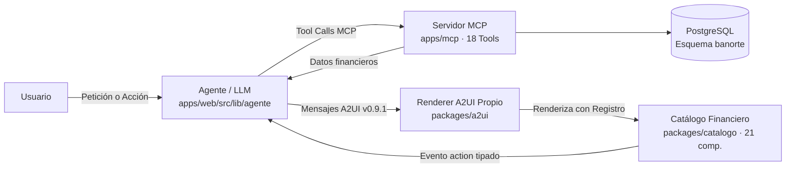

import ArchitectureExplorer from '../../../components/ArchitectureExplorer';
import BanorteAlert from '../../../components/BanorteAlert';

<BanorteAlert type="info" title="Entregable 04 Cumplido">
  Este documento y el diagrama interactivo inferior corresponden al <strong>Entregable 04</strong> de la rúbrica oficial de Banorte: Diagrama de arquitectura y trade-offs entre modelo, protocolo e infraestructura.
</BanorteAlert>

## Diagrama Interactivo de Componentes

<ArchitectureExplorer client:load />

---

## Flujo de Datos de Punta a Punta

El sistema sigue estrictamente la arquitectura de referencia del reto:
**Usuario → Agente/LLM → MCP → A2UI → Componentes**, con la interacción táctil regresando al agente.

### Tabla de Responsabilidades

| Capa | Paquete / Ruta | Responsabilidad Principal | Lo que NO hace | Pruebas |
|---|---|---|---|---|
| **Agente Host** | `apps/web/src/lib/agente/` | Orquestación de intenciones, streaming JSONL, llamadas MCP y emisión de A2UI. | No renderiza JSX; no guarda datos en memoria. | Integrado con AI SDK |
| **Servidor MCP** | `apps/mcp/` | 18 tools de lectura y acción transaccional sobre PostgreSQL. | No sabe de interfaces ni de A2UI. | 103 pruebas unitarias |
| **Renderer A2UI** | `packages/a2ui/` | Validación Ajv contra esquemas oficiales v0.9.1, resolución de bindings y enrutamiento de eventos. | No decide qué componente pintar. | 112 pruebas (76/76 oficiales) |
| **Catálogo A2UI** | `packages/catalogo/` | 21 componentes financieros basados en shadcn/ui y tokens de Banorte. | No consulta la base de datos directamente. | 47 pruebas |
| **Contratos** | `packages/schemas/` | Definiciones Zod de entrada y salida de cada herramienta MCP. | Sin lógica de negocio. | 18 contratos |
| **Base de Datos** | `db/` (PostgreSQL) | Persistencia de 22 tablas en esquema `banorte` y tabla `acciones_aplicadas`. | — | Fixtures deterministas |
