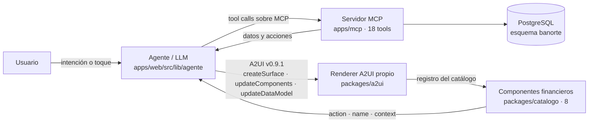

# Visión general de la arquitectura (entregable 04)

Sigue pieza por pieza la **arquitectura de referencia** de la presentación oficial:
Usuario → Agente/LLM → MCP → A2UI → Componentes, y la interacción regresa al agente.

Todo lo que dice este documento está construido y corriendo. Lo puedes comprobar sin
nuestro código: `https://maya-mcp.157.173.204.174.sslip.io/health` lista las 18 tools y
el commit publicado, y `https://maya.157.173.204.174.sslip.io/catalogo/v1.json` es el
catálogo de componentes que el agente tiene permitido invocar.

## Para cualquiera

La persona escribe lo que necesita. Un agente de IA entiende qué quiere y con qué
contexto llega, pide los datos a un "servidor de herramientas" (el MCP) y, en vez de
contestar con texto, **describe la pantalla que resuelve el problema** usando un
lenguaje estándar (A2UI). Nuestra app pinta esa pantalla con componentes que diseñamos
nosotros. Cuando la persona toca un botón, "Aplicar plan", esa acción vuelve al agente,
que ejecuta el cambio real a través del MCP y **vuelve a construir la pantalla** con el
nuevo estado: el saldo de la tarjeta queda en cero y aparece el calendario de pagos.

Ese ciclo, repetido, es la experiencia completa. No hay pantallas programadas de por
medio: la misma frase dicha por dos personas distintas produce dos interfaces distintas,
porque el agente ve el contexto de cada quien antes de decidir qué construir.

## Técnico

### Piezas

| Pieza | Responsabilidad | Lo que NO hace | Tamaño real |
|---|---|---|---|
| Agente (`apps/web/src/lib/agente/`) | Interpreta la intención, llama tools, **emite A2UI** restringido al catálogo, recibe `action` y cierra el ciclo | No pinta; no contiene datos | ~1,240 líneas |
| Servidor MCP (`apps/mcp/`) | 14 tools de **lectura** y 4 de **acción**, que mutan el estado sintético | No sabe de UI ni de A2UI | 103 pruebas |
| Renderer A2UI (`packages/a2ui`) | Valida con los JSON Schema **oficiales**, procesa los mensajes, resuelve bindings, pinta con el registro, enruta `action` y reporta al agente lo que no pudo pintar | No decide qué mostrar | ~1,310 líneas, 112 pruebas |
| Catálogo (`packages/catalogo/`) | 8 componentes React propios sobre shadcn, con schema Zod de props y acciones declaradas | No llama al MCP | 47 pruebas |
| Schemas (`packages/schemas/`) | Zod de entrada y salida de las 18 tools | — | 18 contratos |
| Datos (PostgreSQL, esquema `banorte`) | Tres perfiles demo y el **estado mutable** en `acciones_aplicadas`, con índice único sobre `idempotency_key` | — | ADR 0010 |

**288 pruebas** en verde en los cinco paquetes, sin llave de modelo y sin red.

### El contrato entre las piezas

- **Agente → cliente**: `POST /api/agente` responde **JSONL**, una línea por mensaje:
  `estado`, `tool`, `a2ui`, `texto`, `razon`, `sugerencias`, `error`, `fin`. Sin estado
  en el servidor: cada petición trae el historial, la pantalla actual y el data model.
  `GET /api/agente` devuelve las capacidades (`server_capabilities.json` de A2UI).
- **Cliente → agente**: el toque viaja como `action { name, surfaceId,
  sourceComponentId, context }`, con `idempotencyKey` que arma el renderer. Es el mismo
  objeto que define `client_to_server.json` de la spec.
- **Convención de nombres**: si la acción se llama igual que una tool, **muta estado**;
  `ver_*` solo cambia la vista y `elegir_*` es una selección sin confirmar. Así el
  agente sabe qué hacer sin que se lo digamos caso por caso.

### Una vuelta completa del ciclo, medida en producción

Los tiempos son de la corrida del 2026-09-12 09:00 contra la URL pública, con el modelo
real y los datos de Beto.

| # | Qué pasa | Tools | Lo que se pinta | Tiempo |
|---|---|---|---|---|
| 1 | "Quiero pagar menos intereses de mi tarjeta" | `panorama_inicial` → `simular_reestructura` | `ResumenTarjeta` (héroe) + `PlanDePago` con 12/18/24 meses | 10.5 s |
| 2 | Elige 18 meses y toca **Aplicar plan** | `aplicar_plan_pago` → `consultar_plan` | `Confirmacion` + `ResumenTarjeta` con `planActivo`, saldo **0** y sin atraso + `Calendario` | 5.8 s |
| 3 | "¿Y en qué se me está yendo el dinero?" | `comparar_periodos` | `GastoPorCategoria`, y la razón dice que los intereses bajarán **por el plan del paso 2** | 3.6 s |

El paso 2 es la regla 3 del reto: la interacción con la UI generada produce un cambio
real, y la lectura posterior devuelve otra cosa. El estado vive en PostgreSQL, así que
el cambio sobrevive a un reinicio del servidor.

### Adaptabilidad (criterio 2 de la rúbrica, 20%)

El agente recibe el contexto de la persona **antes** de decidir la interfaz, y el
catálogo le da opciones, no una plantilla. La misma primera frase:

| Perfil | Qué ve el agente | Qué construye | Tiempo |
|---|---|---|---|
| Beto | Tarjeta al 96.7 %, 12 días de atraso | `ResumenTarjeta` + `PlanDePago` | 10.5 s |
| Ana | Sin deuda revolvente, capacidad de ahorro | **`SimuladorMeta`**: si no pagas intereses, que tu dinero los gane | 5.8 s |

Ana cierra su propio ciclo: al crear el apartado se ejecuta `crear_apartado` y vuelve
`MetaActiva` con el avance y la fecha objetivo (2.9 s). Son **dos flujos accionables con
cambio real**, no uno.

### Qué ve el jurado de todo esto

La tira de progreso sobre el lienzo enciende **LLM · MCP · A2UI** conforme llegan las
líneas del stream, y nombra las herramientas MCP que se llamaron en ese turno. No es una
animación decorativa: sale del JSONL crudo de la respuesta. Si un badge está encendido,
esa línea existió.

### Lo que deliberadamente no hicimos

- **Nada de Banorte real.** Datos sintéticos, tres perfiles, sin APIs del banco.
- **Sin ML propio** (ADR 0002). Python solo detrás de una tool, y ningún flujo de la
  demo depende de él. Hoy no existe.
- **Sin autenticación.** Selector de perfil demo, que además es lo que demuestra la
  adaptabilidad.
- **Sin componente de portafolio.** Carmen existe como contraste de perfil y su
  portafolio se ve en la pantalla programada de Productos; el agente no lo construye,
  porque el catálogo no tiene con qué y añadirlo era abrir alcance (ADR 0004).
