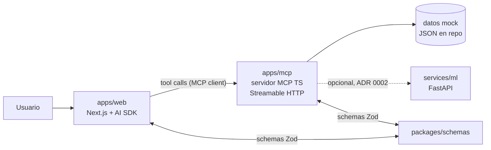

# Visión general de la arquitectura (plan, nada construido aún)

## Para cualquiera

El usuario habla con un asistente en una página web. El asistente no responde solo con
texto: cuando necesita datos (movimientos, saldos, créditos) los pide a un "servidor de
herramientas" (el MCP), y con lo que recibe **decide qué pantalla mostrar** y la dibuja
al momento: una tabla, una gráfica, un formulario. Todo lo que ve el usuario lo generó
el asistente en esa conversación.

## Técnico

### Piezas

| Pieza | Responsabilidad | Lo que NO hace |
|---|---|---|
| `apps/web` | Loop del agente, streaming, render de cada resultado de tool con el componente que corresponde a su schema | No contiene lógica de dominio |
| `apps/mcp` | Expone tools con schema Zod; lee datos mock; llama Python si aplica | No sabe de UI |
| `packages/schemas` | Un schema Zod por tipo de resultado; tipos inferidos para ambos lados | No contiene lógica |
| `services/ml` | Opcional. Endpoints numéricos | No define contratos |

### Flujo de una petición

1. Usuario escribe. `apps/web` manda mensajes + definiciones de tools al modelo.
2. El modelo decide llamar una tool. El host la ejecuta contra `apps/mcp`.
3. La tool devuelve un resultado que cumple un schema de `packages/schemas`.
4. El host, en streaming, renderiza el componente registrado para ese schema.
5. El modelo puede encadenar más tools o cerrar con texto.

### Decisiones abiertas (resolver día 1)

- Si el reto pide MCP Apps (`ui://`), el paso 4 lo hace el cliente MCP y el componente
  vive como recurso del servidor. La estructura no cambia; cambia quién renderiza.
- Modelo: por defecto Claude vía `@ai-sdk/anthropic`. Confirmar si dan API keys.
