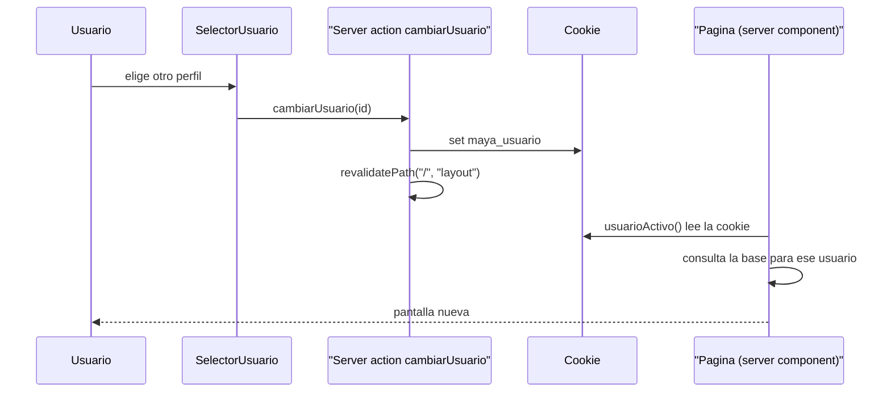

# Shell web

La estructura de la aplicación: las cinco secciones, cómo se navega en móvil y en
escritorio, y de dónde salen los datos.

## Para cualquiera

La app tiene **cinco secciones**, como cualquier app de banco: Inicio, Productos, Maya,
Movimientos y Más. La diferencia está en la tercera.

En **Inicio** ya no ves lo de siempre. **Maya arma la portada de cada persona** con las
mismas piezas de la conversación: a quien trae la tarjeta al límite le pone la tarjeta y el
plan de pago; a quien no tiene tarjeta pero sí un crédito, ese crédito y el simulador de
ahorro; a quien invierte, su portafolio. Arriba dice en dos frases qué ve hoy y qué
recomienda. Lo arma un modelo pequeño y barato, solo cuando la cuenta se movió, y en
segundo plano: si todavía no está, se ve la pantalla programada (saldo, cuentas, tarjetas,
movimientos) con un aviso, y la de Maya entra sola. Detalle en
[inicio-personalizado.md](inicio-personalizado.md).

**Maya** no es una pantalla programada. Es donde le escribes lo que necesitas —"quiero
pagar menos intereses"— y ella **construye la pantalla** para resolverlo: el comparador de
plazos, la gráfica de gasto, el simulador de meta. Nadie programó esas pantallas una por
una; el agente las arma con un catálogo de piezas financieras según lo que pediste.

**Productos** es la cartera: cada tarjeta se ve como el plástico de verdad (el rojo de
Banorte con su patrón de chevrones, chip, contactless y los últimos cuatro dígitos), con
a un lado lo que importa de ella: cuánto debes, qué tanto de tu línea usas, el pago mínimo
y la fecha límite. Abajo, tus cuentas con su total, cada crédito con cuánto llevas pagado
del plazo, y tu portafolio posición por posición. Desde la primera tarjeta se le puede
preguntar a Maya, y la pregunta cambia según cómo esté: a quien la trae al límite se le
ofrece bajar intereses; a quien no, ver en qué se le va el dinero.

**Movimientos** es el historial, y es la única pantalla programada donde la interfaz
*ordena* en vez de solo listar. Arriba, cuánto salió y cuánto entró. Abajo, los movimientos
partidos en bloques con el nombre que la gente usa —*Hoy*, *Ayer*, *Esta semana*, *Semana
pasada*, *Mes pasado*, *Julio*— y el neto de cada bloque a la derecha, así que "cuánto se me
fue esta semana" se contesta sin sumar nada. Se puede buscar por comercio y **marcar varias
categorías a la vez**; al hacerlo, las dos cifras de arriba se recalculan, que es la forma de
contestar "cuánto llevo en restaurantes y transporte". **Más** es quién es la persona, las tres
personas para cambiar con un toque, cómo funciona Maya y el resto de opciones
(`pantalla-mas.md`). El peso del proyecto sigue estando en Inicio y en Maya.

En el celular se navega con una barra abajo de cuatro pestañas, y **Maya al centro, en un
botón redondo elevado**. Eso no es capricho: si Maya fuera una pestaña más se perdería
entre las otras, y es lo único que esta app tiene y las demás no. En computadora, las cinco
secciones viven en un menú lateral blanco que flota sobre el fondo gris.

Se puede cambiar entre tres personas de prueba (Beto, Ana y Carmen) desde el menú. Al
cambiar, todo cambia: los saldos, las tarjetas, y sobre todo **lo que Maya responde a la
misma pregunta**. Es la forma más rápida de mostrar que el agente se adapta al contexto en
vez de repetir una plantilla.

La persona activa se ve al pie del menú lateral: su avatar en negro, su nombre y, completa,
su situación ("Tarjeta al límite, un pago atrasado"). Al tocarla se abre a un lado la lista
de las tres, cada una con su situación, y la elegida marcada. En el celular es el avatar de
arriba a la derecha.

## Técnico

### Las cinco secciones

| Ruta | Sección | Tipo | Datos |
|---|---|---|---|
| `/` | Inicio | Server component + `InicioDeMaya` (cliente) | La portada que armó Maya (`banorte.pantallas_inicio`); de respaldo, la programada: cuentas, tarjetas, movimientos |
| `/productos` | Productos | Server component | Base: cuentas, tarjetas, créditos, portafolio |
| `/maya` | Maya | Client (streaming) | El agente vía `POST /api/agente` |
| `/movimientos` | Movimientos | Server + filtro cliente | Base: movimientos, categorías. El `hoy` del dominio lo calcula la página |
| `/mas` | Más | Server component + `CambiarPersona` (cliente) | Base: resumen y `banorte.usuarios` (`perfilDe`). Ver `pantalla-mas.md` |

`ORDEN_PESTANAS` en [navegacion.ts](../../apps/web/src/components/shell/navegacion.ts) fija
el orden de la barra inferior con Maya en la posición central.

### Dónde vive

```
apps/web/src/
  app/
    layout.tsx                  raiz: fuentes, metadata, viewportFit: cover
    (app)/layout.tsx            el shell; server component, resuelve la cookie
    (app)/acciones.ts           server action: cambiar de usuario demo
    (app)/page.tsx              Inicio
    (app)/productos/page.tsx    Productos: la cartera (plasticos, cuentas, creditos, portafolio)
    (app)/productos/loading.tsx esqueleto con la forma de la cartera
    (app)/maya/page.tsx         Maya, resuelve ?intencion=
    (app)/movimientos/page.tsx  Movimientos
    (app)/mas/page.tsx          Mas
  components/
    shell/
      navegacion.ts             LAS 5 SECCIONES, fuente unica
      sidebar-app.tsx           escritorio
      barra-superior.tsx        titulo, subtitulo y avatar en movil (sin trigger del sidebar: la navegacion es la barra de abajo)
      barra-pestanas.tsx        movil: 4 pestanas + FAB de Maya
      selector-usuario.tsx      cambia de persona demo (pie del sidebar, avatar en movil, Mas)
    inicio/tarjetas-inicio.tsx  heroe, cuentas, tarjetas, movimientos, atajo a Maya
    productos/
      tarjeta-fisica.tsx        el plastico: degradado de marca, chevrones, chip, red
      tarjetas-productos.tsx    TarjetaEnMano, Cuentas, CreditoEnCurso, Inversiones, vacios
    maya/
      consola-maya.tsx          hilo + lienzo + barra de conversacion
      lienzo.tsx                reparte las tarjetas lado a lado (lib/rejilla.ts) y el PLACEHOLDER
      barra-conversacion.tsx    input y chips
    movimientos/
      lista-movimientos.tsx   buscador, multiselector de categorias, lista por periodo
      icono-categoria.tsx     kebab-case -> icono de Lucide, en circulo con tinte
    marca/logo-banorte.tsx      LogoBanorte (completo) e IconoBanorte (isotipo)
  lib/
    marca.ts                    nombre, tagline, aviso legal: un solo lugar
    periodos.ts                 agrupa movimientos por periodo relativo (Hoy, Ayer, Esta semana...)
    usuario-activo.ts           lee la cookie (server-only)
    usuarios.ts                 los tres perfiles demo
    datos/tablas.ts             lector de PostgreSQL + conversiones (server-only)
    datos/consultas.ts          consultas tipadas para las pantallas
    agente/usar-agente.ts       cliente del streaming JSONL
```

### Productos: la cartera

Productos es la vista de detalle de lo que Inicio resume, y la única pantalla programada
que muestra el producto como objeto: el plástico.

**El plástico** (`components/productos/tarjeta-fisica.tsx`) no es una imagen. Es un `div`
con proporción ISO ID-1 (1.586), el degradado de marca como fondo, un `<pattern>` SVG de
chevrones tono sobre tono al 13 % (el del plástico real de Banorte), un chip dibujado con
tokens (`muted` a `border`), el icono `Nfc` de Lucide, `LogoBanorte` en blanco, el tipo
(CRÉDITO / DÉBITO) con el nombre del producto, el número enmascarado (`•••• •••• ••••
4821`) en `font-mono`, el titular y la red en monocromo blanco (dos círculos para
Mastercard, la palabra para Visa). Cero hex: el rojo es `--primary` y `--marca-oscuro`.

Reglas de la skill `diseno-banorte` que la pantalla cumple, y dónde:

| Regla | Cómo |
|---|---|
| El degradado de marca aparece **una vez** | Solo el primer plástico lleva `tono="marca"`; los demás van en `oscuro` (Carmen: Oro en rojo, Débito en negro) |
| **Un solo botón primario** | Vive en la primera `TarjetaEnMano` (`heroe`). El resto son `outline` (el de "Todavía no inviertes") |
| El monto es lo más grande de su tarjeta | `text-3xl` con `.monto-heroe` en las cuatro tarjetas; el plástico no lleva monto a propósito |
| El rojo no es alarma | El atraso va en badge `bg-oscuro`; el avance de un crédito y el peso de una posición van en `bg-oscuro` (lo bueno); solo el uso de la línea va en rojo (lo que duele) |
| Dato sensible enmascarado | Solo los últimos cuatro dígitos; la CLABE no se pinta |

**Orden y rejilla.** Primero los plásticos (crédito antes que débito: es el que trae un
saldo que decidir), luego `Cuentas`, un `CreditoEnCurso` por crédito y el portafolio (o
`SinInversiones`, que lleva a Maya con la pregunta que le conviene a Beto). La rejilla es la
bento de siempre con `grid-flow-dense`: cuando hay dos plásticos anchos seguidos, las
cuentas rellenan el hueco a la derecha del primero en vez de dejarlo vacío. (Era la misma de
Inicio; desde el 2026-09-13 Inicio usa masonry —`docs/algoritmos/masonry-del-inicio.md`— y
Productos se quedó con la bento, que le sirve porque sus tarjetas sí miden parecido.)

**La pregunta a Maya depende de la tarjeta.** Con la línea al 80 % o con días de atraso,
el botón manda `Quiero pagar menos intereses de mi tarjeta`; si no, `¿En qué se me está
yendo el dinero?`. Son los dos prompts del guion, que ya producen una pantalla verificada.

**Datos.** `Tarjeta` en `lib/datos/consultas.ts` creció con `cuentaId` (para el disponible
del débito), `tasaAnual`, `cat`, `fechaCorte`, `fechaLimitePago` y `pagoNoInteresesCentavos`;
todos salían ya de `banorte.tarjetas`. Las cuentas de tipo `credito` no entran en el total
de `Cuentas`: esa deuda ya está en el plástico y en Créditos (mismo criterio que
`resumenDe`). Las celdas de tres datos usan `formatearFechaCorta` (`14 sep`) porque
`14 de septiembre` no cabe en 90 px sin truncarse.

Verificado en el navegador (Chromium de Playwright, tres perfiles, 390 y 1280 px): sin
scroll horizontal, sin errores de consola, y el esqueleto de `loading.tsx` mide lo que
llega (475 px el héroe en móvil, 247 en escritorio).

### Movimientos: el historial que se ordena solo

Tres piezas, y ninguna es decorativa.

**La tarjeta de totales, arriba.** `Gastado` y `Recibido`, cada uno en `text-3xl
tabular-nums`, calculados con `totalizar()` **sobre lo filtrado**. La etiqueta cambia a
`Gastado (filtrado)` en cuanto hay filtro, para que nadie confunda un subtotal con el total.
Van dos cifras separadas y no un neto: un neto de +$16,753 esconde que salieron $121,603.
Apiladas hasta `sm` porque a 360 px dos montos de 30 px en dos columnas no caben, y la
salida no era encogerlos (el monto es lo más grande de su tarjeta) ni truncarlos (un monto
cortado miente).

**El multiselector de categorías.** Un `DropdownMenu` con `DropdownMenuCheckboxItem`, no una
fila de chips. Antes era un `ToggleGroup` horizontal y tenía dos problemas: con 18
categorías era scroll horizontal de dos pantallas, y aunque el `value` de Base UI es un
arreglo, el filtro **solo usaba `categoria[0]`**, así que de multiselector no tenía nada. El
menú ocupa una línea, permite varias, dice cuántas hay activas sin abrirse (`2 categorías` +
badge) y trae una `X` de 44 px para limpiar. Los `CheckboxItem` de Base UI **no cierran el
menú al hacer clic**, que es justo lo que se necesita para marcar tres seguidas.

**La lista partida por periodo.** `agruparPorPeriodo()` (`lib/periodos.ts`) devuelve los
grupos del más reciente al más antiguo, cada uno con su neto. Cada grupo es una tarjeta con
su encabezado flotando **encima del lienzo, no dentro de la tarjeta**: así el `sticky` no
pelea con el borde redondeado. Va pegado a `top-0` y no a `top-2` porque con cualquier hueco
se ve pasar una franja de contenido por encima del encabezado, y **sin margen negativo**
porque sangrar 4 px hacia el padding del lienzo abría una barra horizontal a 360 px (medido
en un clon de 360 px: `scrollWidth` 364 contra 360). En los grupos `Hoy` y `Ayer` el renglón
**no repite la fecha**: el encabezado ya la dijo.

El algoritmo de los periodos, con sus casos de borde (que "Este mes" puede quedar vacío, que
"Esta semana" puede contener días del mes anterior), está en
[docs/algoritmos/agrupacion-por-periodo.md](../algoritmos/agrupacion-por-periodo.md).

**El `hoy` se calcula en el servidor**, con `hoyEnZona()` en `America/Monterrey`, y viaja
como prop. No es un detalle: es lo que decide a qué periodo pertenece cada movimiento, y el
servidor de producción corre en UTC+2, donde a las 6 de la tarde de Monterrey ya es el día
siguiente. Si cada lado leyera su propio reloj, el HTML del servidor y el del navegador no
coincidirían y React marcaría un desajuste de hidratación.

**Los iconos.** `icono-categoria.tsx` mapea el `icono` kebab-case del dato al componente de
Lucide, en un círculo de 36 px con el tinte de la marca (verde para abonos). El mapa es
explícito y no dinámico para que el `tree-shaking` se lleve solo esos 18. Son monocromos a
propósito: las categorías traen un `color` propio en la base, y 18 colores en una lista es
un arcoíris. El icono no es adorno —es lo que permite escanear 300 renglones sin leer cada
etiqueta— y por eso va con `aria-hidden`: el renglón ya dice la categoría en texto.

Verificado en el navegador con los datos de Beto: ocho grupos (`Hoy`, `Ayer`, `Esta semana`,
`Semana pasada`, `Mes pasado`, `Julio`, `Junio`, `Mayo`) con sus netos, sin `Este mes`
—que es el caso de borde del algoritmo, con hoy = sábado—; el filtro con dos categorías baja
a `117 de 300 movimientos` y deja `Gastado (filtrado) $19,393.00`; sin desbordamiento
horizontal (1077 = 1077) y sin errores de consola.

### El hilo guarda las pantallas, no solo el texto

La conversación de Maya es **una sola lista en orden** (`hilo`, en
`lib/agente/usar-agente.ts`) con las dos cosas que pasaron: lo que se dijo y lo que Maya
construyó. Al cerrar un turno (la línea `fin` del stream) la superficie se **congela** en
esa lista (con las líneas del stream de ese turno, que no se pintan) y ahí se queda.

**Lo que ve la persona mientras Maya trabaja** (`components/maya/progreso-maya.tsx`): un
renglón con spinner que sigue la última línea `estado` del stream —"Entendiendo lo que
necesitas", "Consultando tus datos", "Armando tu pantalla"— y **desaparece al terminar**.
Hasta el 2026-09-13 era una tira con los badges LLM · MCP · A2UI, los nombres de las tools y
"3 pasos · 5.2 s", y se quedaba pegada a cada pantalla del hilo; se quitó porque era texto
técnico en la pantalla de la persona. Por lo mismo:

- Un toque se lee en palabras (`Tocaste: Aplicar el plan de pago`), no como
  `aplicar_plan_pago {"plazoMeses":12,…}`. La traducción es `accionLegible` en
  `lib/para-la-persona.ts`; al modelo le sigue llegando el nombre y el `context`.
- Una línea `error` del stream ya no entra al hilo como `⚠ <mensaje del servidor>`: va a la
  consola del navegador. La persona lee la frase que el agente manda después en `texto`, y
  si no llegó ninguna, `AVISO_DE_FALLO` ("Algo falló de mi lado. Intenta de nuevo.").
- `app/(app)/error.tsx` ya no pinta el `message`, el `digest` ni "revisa `DATABASE_URL`": dice
  que no se pudo traer la información y los manda a la consola.

Antes el hilo guardaba solo texto y la pantalla vivía aparte, así que **cada pregunta
nueva borraba la tarjeta anterior**: al desplazarse hacia arriba quedaban frases sueltas
("en agosto tu mayor gasto fue Vivienda") sin la pantalla que las sostenía, y la
conversación no se podía leer. Ahora se lee como un chat: pregunta, consejo, pantalla.

Tres detalles que hacen que funcione:

- **Congelar es quedarse con la referencia.** `procesar` nunca muta: devuelve estado nuevo
  en cada mensaje, así que el objeto congelado no puede cambiar por debajo.
- **La del turno en curso se pinta aparte** hasta que se congela, y `calcularSuperficieViva`
  decide cuál es comparando por referencia. Es la única decisión del hilo que se puede
  equivocar en silencio (pintar dos veces, o no pintar), así que es una función pura y
  tiene pruebas en `lib/__tests__/hilo.spec.ts`.
- **El historial que viaja al agente se deriva del mismo hilo** (solo las entradas de
  texto, como exige el contrato). Una sola conversación: imposible que las dos versiones
  se separen.
- Un turno que no pintó nada (prosa, error) no congela nada: no deja hueco.

### El usuario activo va en cookie, no en contexto de React

Es la decisión estructural del shell y conviene entenderla antes de tocar nada.

Inicio, Productos y Movimientos son **componentes de servidor**: consultan PostgreSQL
directo. Para eso necesitan saber de quién son los datos **antes** de que exista cualquier
contexto de cliente. Un `useState` en un provider no le sirve al servidor; una cookie sí,
porque llega en el request del primer render.



Sin el `revalidatePath` la cookie cambia pero las pantallas siguen mostrando el cache del
usuario anterior. El id se **valida contra `USUARIOS`** en la server action: llega del
navegador y termina en una consulta a la base.

### El selector de persona

`components/shell/selector-usuario.tsx`. Es un `Select` de shadcn (Base UI) con una prop
`variante` que decide la forma y hacia dónde abre el menú:

| Variante | Dónde | Trigger | El menú abre |
|---|---|---|---|
| `sidebar` | Pie del sidebar (`sidebar-app.tsx`) | Tarjeta `bg-muted` con avatar, nombre, contexto y `ChevronsUpDown` | Escritorio: **a la derecha**, `align="end"`, `sideOffset={16}`, fuera de la tarjeta blanca (el `NavUser` del bloque `sidebar-07` de shadcn). En el sheet de móvil, arriba |
| `avatar` | Barra superior en móvil (`barra-superior.tsx`) | Solo el avatar, objetivo táctil de 48 px | Abajo, alineado a la derecha |
| `tarjeta` (default) | Sin uso desde el 2026-09-13: Más cambia de persona con `CambiarPersona` (`components/mas/`) | La misma tarjeta, a lo ancho | Abajo, del ancho del trigger |

**El color del avatar dice quién es quién**: oscuro (`bg-oscuro text-white`) es la persona,
el mismo tono de sus burbujas en el chat (`consola-maya.tsx`); el rojo queda para Maya. En
el menú, la persona elegida lleva el renglón en `bg-sidebar-accent` (el tinte del ítem
activo del sidebar), el avatar oscuro y la palomita del propio `SelectItem` en
`text-primary`; las otras, avatar blanco con aro gris. Al pasar el cursor el renglón se pone
gris y el nombre rojo, como cualquier item de menú del proyecto. Arriba de la lista, un
`SelectLabel`: "Cambiar de persona / Maya adapta lo que te muestra a cada una".

Detalles que se midieron en el navegador (Chromium de Playwright, 1440 y 390 px):

- **El contexto nunca se corta con puntos**: es lo que explica por qué la pantalla cambia. En
  el trigger del sidebar baja a dos renglones (`line-clamp-2` + `whitespace-normal`, porque
  el trigger base es `whitespace-nowrap`); en el menú (`w-80`) cabe en uno.
- **El nombre más largo cabe**: "Ana Sofía Treviño" mide 123 px en Geist 14 semibold y el pie
  del sidebar le deja 128 con `gap-2`, `px-2.5` y `gap-2.5` junto al avatar. Con `gap-3` y
  `pr-3` le quedaban 120 y se cortaba.
- **Cambio optimista**: al elegir, `useOptimistic` pinta a la persona nueva en el trigger al
  instante, con spinner y `aria-busy` mientras la server action escribe la cookie y el
  `revalidatePath` rearma la pantalla. Probado con la acción retrasada 2 s.
- `SelectTrigger` (`components/ui/select.tsx`) ganó la prop **`icono`**: con `false` no pinta
  su `ChevronDownIcon`. Antes el selector ponía el suyo y se veían **dos flechas juntas**.
- Los `!` del contexto y de las iniciales no son pereza: el `SelectItem` base pinta a todos
  sus descendientes con `not-data-[variant=destructive]:focus:**:text-accent-foreground`
  (0,3,0). Sin ellos, al pasar el cursor el contexto se volvía rojo y las iniciales blancas
  se perdían sobre el oscuro.

Hasta el 2026-09-13 el trigger tenía el borde gris de un campo de formulario, el menú abría
hacia arriba 32 px más ancho que el trigger (se salía del sidebar por los dos lados), la
elegida iba con el degradado de marca (un segundo bloque rojo junto al ítem de Maya) y el
nombre y el contexto se cortaban con puntos en los dos lugares.

### Navegación en los dos tamaños

Una sola estructura, no dos diseños. `< 768 px` el sidebar es un sheet que abre el trigger
de la barra superior y la navegación real es la barra de pestañas; `>= 768 px` el sidebar
flota permanente y la barra de pestañas desaparece con `md:hidden`.

**El FAB de Maya** es `absolute -top-5 size-14` con el degradado de marca, elevado sobre la
barra. Patrón de bottom app bar con FAB anclado de Material. Resuelve una tensión real:
navegación de app bancaria sin que el asistente quede como "una pestaña más". Dentro del
círculo va el isotipo de Banorte en blanco.

**El logotipo** (`components/marca/logo-banorte.tsx`) va en dos lugares: el completo en el
header del sidebar —donde antes había una insignia con la inicial y la palabra "Maya"— y el
isotipo en todo lo que representa a Maya (item del sidebar, FAB, avatar del saludo, atajo de
Inicio). Son SVG en línea con `fill="currentColor"`, no ``: el isotipo tiene que salir
blanco sobre el degradado rojo y un `` no se recolorea. Los archivos fuente están en
`public/marca/`. Usar el logotipo oficial es una decisión con riesgo de marca: se levantó la
prohibición del ADR 0009 el 2026-09-12 y hay que confirmarlo con los mentores antes del
pitch (ver la enmienda del ADR).

### La capa de datos

`lib/datos/` consulta **PostgreSQL** (esquema `banorte`) con `pg`. Es la única fuente de
datos del sistema: no hay CSV ni volcados en el repo (ADR 0010). La conexión sale de
`DATABASE_URL`, y **es obligatoria**.

- `leerTabla` está envuelto en `cache` de React: Inicio pide `cuentas` desde tres
  componentes y la consulta se hace una vez por request.
- `server-only` en los dos archivos: aquí hay credenciales y una conexión; si alguien los
  importa en un componente de cliente, falla al compilar.
- Si la base no responde, `leerTabla` avisa en el log y devuelve `[]`: la pantalla muestra
  su estado vacío y la app no se cae. **Ojo con eso al depurar**: una base inalcanzable y
  un usuario sin movimientos se ven exactamente igual. Si todo sale en cero, lo primero es
  revisar `DATABASE_URL`, no los componentes.
- El `.env` vive en la **raíz** del repo y Next corre con `cwd` en `apps/web`, así que
  `next.config.ts` lo carga explícitamente con `process.loadEnvFile`. Sin eso, arrancar con
  `pnpm --filter @maya/web dev` (o cualquier cosa que no sea `scripts/dev.sh`, que es bash
  y no corre en Windows) dejaba la app sin `DATABASE_URL` y **todas las pantallas vacías**.
- Los montos salen en **centavos**; formatear es de quien pinta (`lib/dinero.ts`).
- `consultas.ts` tiene un segundo consumidor: las cinco rutas `GET /api/*`, que exponen
  los mismos datos por HTTP para quien consulta de fuera. Las páginas **no** pasan por
  ahí. Ver [la API REST de lectura](api-rest-lectura.md).

### Tres trampas que ya costaron un bug

Las tres se encontraron midiendo el DOM en el navegador, no leyendo el código:

1. **`data-active:` y `data-[size=...]:` ganan por especificidad.** Pasó dos veces. El ítem
   activo de Maya salía rojo sobre rojo porque `text-primary-foreground` (0,1,0) pierde
   contra `data-active:text-sidebar-accent-foreground` (0,2,0); y el trigger del selector
   de usuario se quedaba en 32 px porque `h-auto` pierde contra
   `data-[size=default]:h-8`. **La regla: para pisar un estilo de shadcn hay que usar el
   mismo variant** (`data-active:text-...`, `data-[size=default]:h-auto`).
2. **`overflow-x-auto` dentro de un flex necesita `min-w-0`.** El filtro de categorías de
   Movimientos era un `ToggleGroup` con `w-max`; sin `min-w-0`, ese ancho se volvía el
   min-content del flex y **estiraba el layout 256 px fuera de la pantalla**. Ese
   `ToggleGroup` ya no existe (lo reemplazó el menú multiselector), pero el `min-w-0` del
   `SidebarInset` y el del contenedor **se quedan**: es la red que evita que el próximo hijo
   ancho vuelva a empujar el layout.
3. **`SidebarInset` ya es un `<main>`.** Meterle otro `<main>` dentro daba dos por
   documento. El contenido va en `div`.

Y una cuarta, del mismo tipo: **el `Avatar` de Base UI es un `<div>`**, así que meterlo
dentro del `<span>` de un `SelectValue` producía HTML inválido y un desajuste de
hidratación silencioso. Se resuelve con `render={<span />}`, que es la forma de Base UI de
cambiar el elemento.

### Rendimiento: de dónde venía la sensación de lentitud

Medido con los tiempos del servidor de desarrollo y con `Measure-Command`. Cuatro causas,
tres arregladas:

| Causa | Efecto | Estado |
|---|---|---|
| Cada navegación re-leía y re-parseaba los 365 KB de `movimientos.csv` | 100–300 ms por ruta | **Ya no aplica**: con el ADR 0010 los datos salen de la base, no de un archivo |
| `/movimientos` mandaba los ~700 movimientos del usuario al navegador | ~1 200 ms → **~250 ms** | **Arreglado**: `TOPE_MOVIMIENTOS = 300` |
| Sin `loading.tsx` no pasaba nada al tocar una pestaña | Se sentía trabado aunque tardara poco | **Arreglado**: skeletons del tamaño del contenido |
| Modo desarrollo: Turbopack compila cada ruta en su primera visita y **`<Link>` no hace prefetch** | Picos de 1,5 a 2,9 s | **No se arregla**: es así por diseño. En producción el prefetch está activo y la ruta ya está compilada |

La última fila importa para el ensayo: **la demo debe correr con `pnpm build` y
`pnpm start`, no con `pnpm dev`**. En desarrollo los saltos de dos segundos son del
compilador, no de la app.

Contrapartida del cache de proceso: si regeneras los datos con
`node scripts/generar-datos.mjs`, hay que **reiniciar el servidor** para verlos.

### Base UI, no Radix

`components.json` usa el estilo `base-nova` y la dependencia es `@base-ui/react`. Las
diferencias que importan aquí:

- **`render={<Link />}`**, no `asChild`. Con `nativeButton={false}` cuando lo renderizado no
  es un `<button>`.
- **`Select` necesita `items`** en la raíz, y los `SelectItem` van dentro de `SelectGroup`.
- **`ToggleGroup` no lleva `type`** y su `value` es siempre un arreglo.
- **Un `DropdownMenuLabel` tiene que vivir dentro de un `DropdownMenuGroup`.** Fuera de él,
  Base UI **revienta al abrir el menú** con `MenuGroupContext is missing` y el error
  boundary de la ruta se come la pantalla completa. Peor todavía para depurar: el mensaje
  del boundary dice "casi siempre es la conexión a la base de datos", que aquí es falso
  —el fallo es de render—. Pasó con el multiselector de Movimientos.
- **Los `DropdownMenuCheckboxItem` no cierran el menú al hacer clic**, a diferencia de los
  `Item` normales. Es lo que hace usable un multiselector, y no hay que configurarlo.

### Cómo probarlo

```bash
pnpm -r typecheck
pnpm --filter @maya/web build
pnpm --filter @maya/web dev      # http://localhost:3000
```

Verificado al 2026-09-12 11:45, midiendo el DOM en el navegador:

- Las 5 rutas cargan, cada una con su `<h1>`, y **ninguna desborda**
  (`scrollWidth === clientWidth`).
- Exactamente **un `<main>`** por documento y **una sola tarjeta con degradado** en Inicio.
- El ítem activo de Maya tiene texto **blanco** (`lab(100 0 0)`) sobre el degradado.
- Las 4 etiquetas de pestaña **caben a 360 px** sin desbordar, con objetivos táctiles de
  56 px.
- La barra de pestañas tiene `display: none` en escritorio.
- Consola sin errores ni warnings de React o Next.

### Lo que falta

- ~~El lienzo de Maya es un placeholder.~~ **Ya no**: los 8 componentes del catálogo
  existen, pintan, y el hilo guarda la pantalla de cada turno (ver abajo). El placeholder
  solo sale antes del primer turno.
- **Pagos y servicios, Estados de cuenta y Seguridad** están en Más como mosaicos apagados
  que dicen "Fuera de este prototipo". No tienen datos: el territorio Pagos quedó fuera del
  esquema. Los datos personales ya no están pendientes: salen de `banorte.usuarios`.
- ~~Sin `skeleton` de carga.~~ Hay `loading.tsx` en el grupo `(app)`.
- **Inicio depende del reloj y de la base para su portada.** Sin `DATABASE_URL` o sin
  llave, es la programada de siempre; con todo, la primera visita después de un
  `reiniciar-estado` muestra la programada unos segundos mientras Maya rearma.
- **No se ha probado en un dispositivo real**, solo midiendo el DOM: el harness de navegador
  disponible no puede cambiar el viewport. Conviene abrirlo en Chrome DevTools a 360×740
  antes del ensayo.
